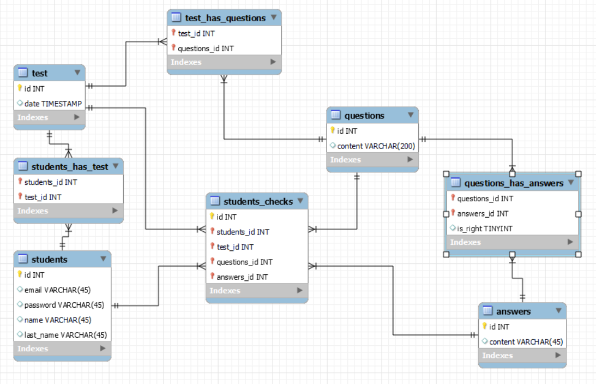

# Kartkówka

1. Sklonuj to repozytorium do swojego kont na GitHub.
Pamiętaj żeby na koniec wysłać wszystkie swoje zmiany na GitHub. 
2. Stwórz plik index.php w którym:
    1. wykonasz połączenie do bazy danych
    2. zrealizujesz zapytanie pobierające pytania i odpowiedzi z bazy danych "quiz" (jedno lub dwa zapytania)
    3. wyświetl wyniki zapytania z punktu drugiego

Dostęp do bazy danych do użycia w kodzie:  
DB_HOST 51.123.43.245  
DB_USER admin  
DB_PASS 123456  
DB_NAME quiz

**Na ocenę 2 należy wykonać cały punkt 1 i podjąć próbę wykonania punktu 2 (próba oznacza wykonanie przynajmniej w 80% jednego z punktów 2.i, 2.ii lub 2.iii)**